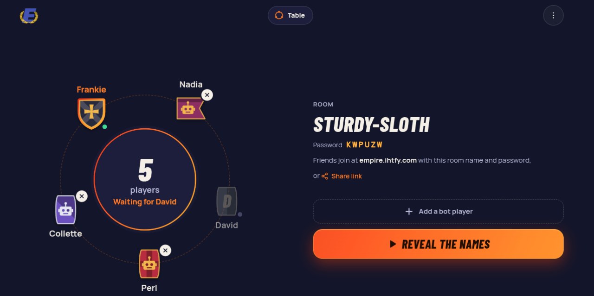
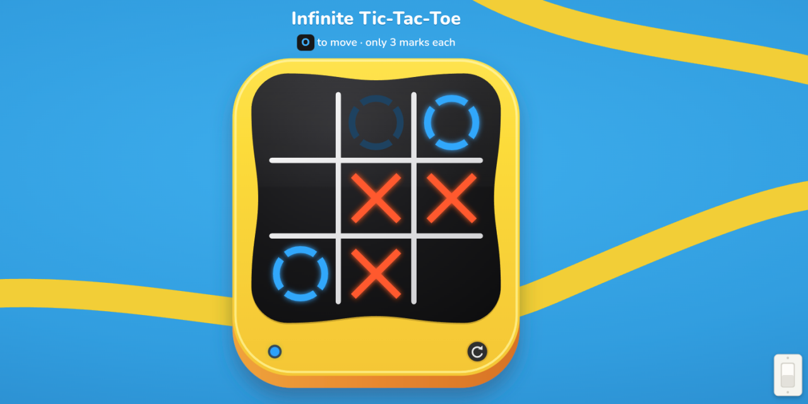
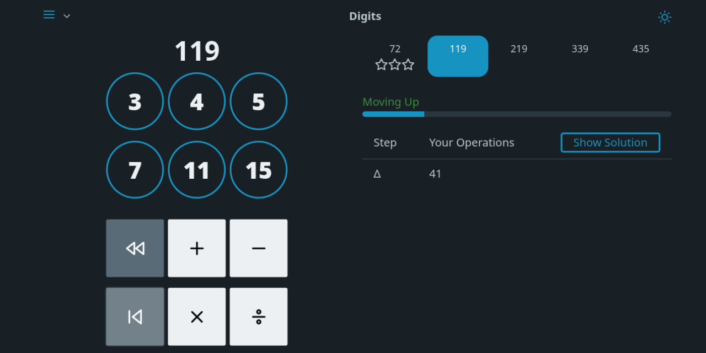
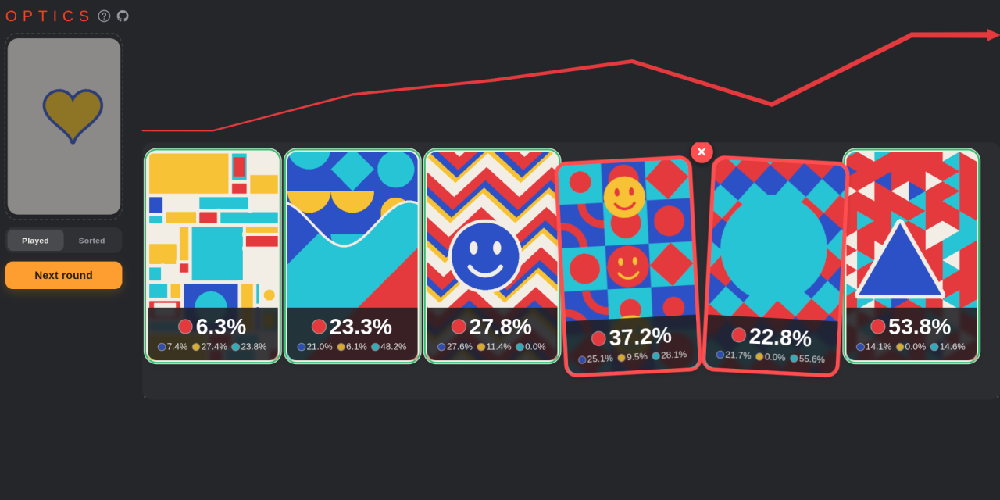
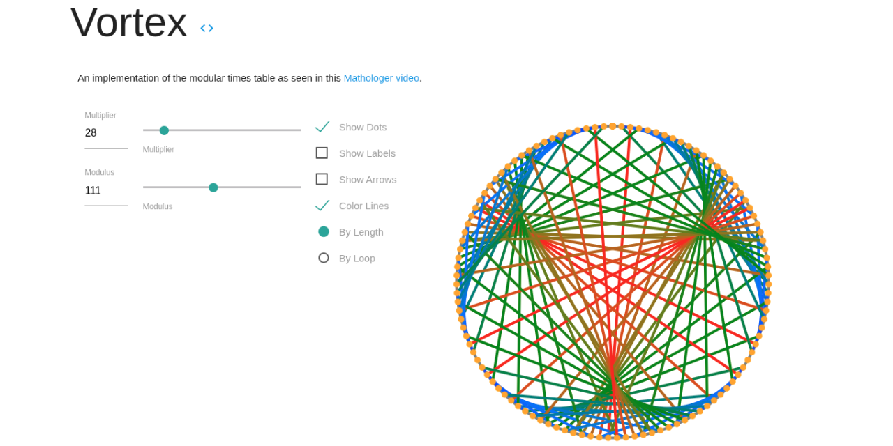

<h1 align="center">Frankie</h1>

  I build small, playable puzzle and party games for the browser.

  
  
  

## Play something

<table>
  <tr>
    <td align="center" width="33%">
      <a href="https://empire.ihtfy.com">
         
        <b>Empire</b>
      </a> 
      Party game with an automated gamemaster
    </td>
    <td align="center" width="33%">
      <a href="https://iq.ihtfy.com">
         
        <b>Raven</b>
      </a> 
      Randomly generated progressive matrices
    </td>
    <td align="center" width="33%">
      <a href="https://bolt.ihtfy.com">
         
        <b>TTTBolt</b>
      </a> 
      Infinite Tic-Tac-Toe
    </td>
  </tr>
  <tr>
    <td align="center" width="33%">
      <a href="https://digits.ihtfy.com">
         
        <b>Digits</b>
      </a> 
      Number game inspired by NYT Digits
    </td>
    <td align="center" width="33%">
      <a href="https://optics.ihtfy.com">
         
        <b>Optics</b>
      </a> 
      Web version of the Illusion card game
    </td>
    <td align="center" width="33%">
      <a href="https://vortex.ihtfy.com">
         
        <b>Vortex</b>
      </a> 
      A modular times table
    </td>
  </tr>
</table>

 

<picture>
  <source media="(prefers-color-scheme: dark)" srcset="https://raw.githubusercontent.com/IHTFY/IHTFY/output/github-snake-dark.svg">
  <source media="(prefers-color-scheme: light)" srcset="https://raw.githubusercontent.com/IHTFY/IHTFY/output/github-snake.svg">
  
</picture>
